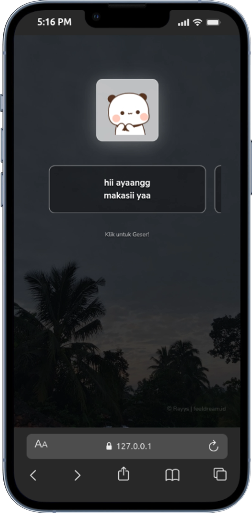

<div align="center">

# 💌 Makasih Ayang

### *Website Interaktif Ungkapan Terima Kasih untuk Orang Tersayang*

[](https://developer.mozilla.org/en-US/docs/Web/HTML)
[](https://developer.mozilla.org/en-US/docs/Web/CSS)
[](https://developer.mozilla.org/en-US/docs/Web/JavaScript)

---

</div>

## ✨ Tentang Proyek

**Makasih Ayang** adalah website interaktif yang dirancang khusus untuk mengungkapkan rasa terima kasih kepada orang tersayang dengan cara yang unik dan berkesan. Website ini menampilkan animasi yang menarik, stiker lucu, dan pesan-pesan manis yang dapat dikustomisasi sesuai keinginan.

### 🎯 Fitur Utama

- 🎵 **Background Music** - Musik latar yang romantis untuk menemani pengalaman
- 💝 **Animasi Interaktif** - Tombol LOVE yang dapat diklik dengan efek animasi hati berjatuhan
- 🐼 **Stiker Lucu** - Berbagai stiker animasi yang menggemaskan
- 📱 **Responsive Design** - Tampilan optimal di berbagai perangkat
- ✍️ **Pesan Kustom** - Mudah untuk mengedit dan menyesuaikan pesan pribadi
- 🎨 **Desain Modern** - Interface yang clean dan aesthetic

---

## 📸 Preview

<div align="center">



*Tampilan website dengan animasi stiker dan pesan interaktif*

</div>

---

## 🚀 Cara Menggunakan

### 1️⃣ **Clone atau Download**
```bash
git clone <repository-url>
```
atau download langsung file ZIP

### 2️⃣ **Buka File**
- Buka file `index.html` di browser favorit Anda
- Atau klik dua kali pada file `index.html`

### 3️⃣ **Nikmati!**
- Klik tombol ❤️ LOVE untuk memulai
- Geser untuk melihat pesan selanjutnya
- Nikmati animasi dan musiknya

---

## 🎨 Kustomisasi

### 📝 Mengedit Pesan

Buka file `index.html` dan cari bagian komentar:

```html
<!-- Edit Pesan di Sini -->
```

Ubah teks di dalam tag `<span>` sesuai keinginan Anda.

### 🎵 Mengganti Musik

1. Siapkan file audio format `.mp3`
2. Letakkan di folder yang sama dengan `index.html`
3. Ganti nama file di bagian:

```html
<!-- Ganti Audio di sini -->
<audio src="./nightchanges.mp3" id="linkmp3" class="sembunyi"></audio>
```

### 🖼️ Mengganti Background

Ganti file gambar di folder `assets/images/` atau ubah path di:

```html
<!-- Wallpaper / Background -->

```

---

## 📁 Struktur Folder

```
Makasihh/
│
├── index.html              # File utama website
├── README.MD               # Dokumentasi proyek
├── favicon.png             # Icon website
├── hasil.png               # Screenshot preview
├── nightchanges.mp3        # File musik background
│
└── assets/
    ├── style.css           # Styling website
    ├── makasiayang.js      # Script interaktif
    └── images/             # Folder gambar & stiker
        ├── awan.jpg
        ├── pandaputih.gif
        ├── pusn.gif
        ├── wortel.gif
        ├── ngumpet.gif
        └── bwa2.gif
```

---

## 💡 Tips & Trik

> [!TIP]
> **Personalisasi Maksimal**
> - Gunakan foto kalian berdua sebagai background
> - Ganti musik dengan lagu favorit bersama
> - Tambahkan pesan-pesan spesial yang hanya kalian yang tahu

> [!NOTE]
> **Kompatibilitas Browser**
> - Website ini bekerja optimal di Chrome, Firefox, Safari, dan Edge versi terbaru
> - Pastikan JavaScript diaktifkan di browser Anda

---

## 🛠️ Teknologi yang Digunakan

| Teknologi | Kegunaan |
|-----------|----------|
| **HTML5** | Struktur website |
| **CSS3** | Styling dan animasi |
| **JavaScript** | Interaktivitas |
| **SweetAlert2** | Pop-up dialog yang cantik |
| **TypeIt** | Efek typing animation |
| **Font Awesome** | Icon hati berjatuhan |
| **Google Fonts** | Typography (Nunito Sans, Sono, Nerko One) |

---

## 📱 Responsive Design

Website ini dioptimalkan untuk berbagai ukuran layar:

- 📱 **Mobile** - Smartphone (iOS & Android)
- 📱 **Tablet** - iPad dan tablet lainnya  
- 💻 **Desktop** - Laptop dan PC
- 🖥️ **Large Screen** - Monitor besar

---

## 🎭 Credits

> Made with ❤️ by **Rayys**
> 
> - 🌐 Blog: [feeldream.id](https://feeldream.id)
> - 📸 Instagram: [@rayyarrr](https://instagram.com/rayyarrr)
> - 🎵 TikTok: [@feelthisray](https://tiktok.com/@feelthisray)
> - 📧 Email: rayyar73@gmail.com

---

## 📄 Lisensi

Proyek ini dibuat untuk tujuan personal dan edukasi. Silakan gunakan dan modifikasi sesuai kebutuhan Anda! 

---

<div align="center">

### 💝 Dibuat dengan Cinta untuk Orang Tersayang 💝

**Jangan lupa beri ⭐ jika proyek ini bermanfaat!**

---

*"Kadang kata 'terima kasih' sederhana bisa berarti segalanya"* ✨

</div>
